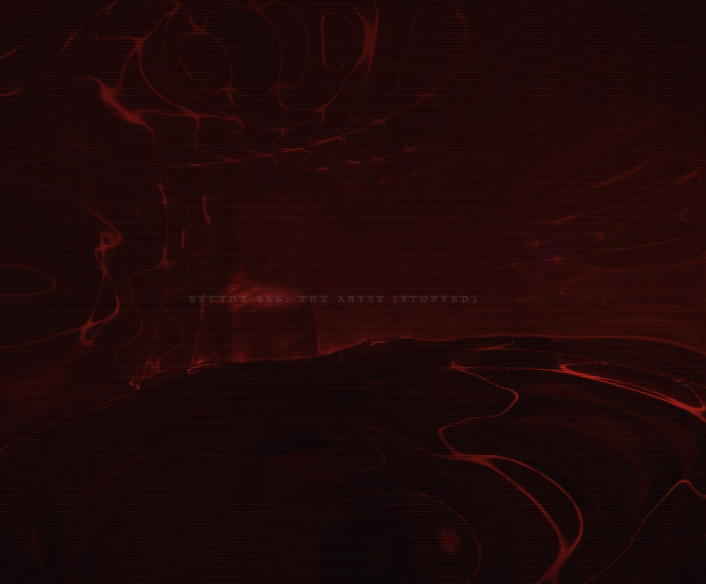

<div align="center">

</div>

𖤐𖤐𖤐𖤐𖤐

# [∳void ∂t]₂ ∩ [hell]ˣ ∉ [⦰∞]

to face death for the first time at the very moment it's come knoking on your door,
how i've come to believe it would feel. this shader, a journey to simulating that horror.

__watch 3 iterations and you'll see.__


---

## journeys

The landing page (`/`) is an index grid of shader **journeys**. Each journey is
its own route under `app/journeys/<slug>/`.

```
app/
  page.tsx                  # index grid landing
  journeys/
    registry.ts             # journey metadata (single source of truth for the grid)
    liminal/                # THE LIMINAL JOURNEY (raymarched descent + audio)
    stairwell/              # THE STAIRWELL (impossible brutalist descent + audio)
    skybridges/             # SKYBRIDGES (collapsing glass spans over a cloud sea)
    foundry/                # THE FOUNDRY (seven halls, rigid-body physics)
    hollow-orchard/         # THE HOLLOW ORCHARD (fungal descent + audio)
    natatorium/             # THE NATATORIUM (flooded poolrooms, turning route + audio)
    switchback/             # THE SWITCHBACK (dreamcore mine railway, gravity cart + audio)
components/
  JourneyGrid.tsx           # grid + shared-preview host
  JourneyCard.tsx           # screenshot poster + hover-to-live preview
  ShaderPreviewLayer.tsx    # ONE shared WebGL canvas for all card previews
  withShaderJourney.tsx     # HOC template: one fragment shader -> a full route
hooks/
  use-pan-control.ts        # pointer + gyroscope view panning (tweened)
  use-journey-runtime.ts    # settings ref, display filter, resize, FPS, fullscreen
  use-audio-engine.ts       # lazy per-journey audio + mute button state
lib/
  shaderQuad.ts             # reusable full-screen-quad shader runner
  frameLoopManager.ts       # ONE frame-capped rAF shared by every templated journey
  panControl.ts             # framework-free pan controller behind use-pan-control
tools/
  shoot-posters.mjs         # re-capture public/journeys/<slug>.jpg from the live routes
```

### looking around

Every journey steers its camera from one normalized `uPointer` (-1..1, y up),
fed by `lib/panControl.ts`:

* **pointer / touch** — absolute position over the viewport.
* **gyroscope** — device orientation is summed on top wherever the device
  reports it, so a phone pans by tilting as well as dragging. Tilt is measured
  against the pose you were holding when the readings started (and re-zeroed on
  rotation or when the tab comes back), and mapped through the screen
  orientation so "right" is right in landscape too. iOS only hands out
  orientation after a permission prompt. Gyroscope look can be enabled or
  disabled in **GRAPHICS & CONTROLS**; enabling it requests permission directly,
  while the default-on first visit still requests once on the first page tap.
* **tweening** — small moves follow the pointer immediately; a *jump* (a tap
  landing far from the last touch, a finger lifted and re-planted) is eased over
  a distance-scaled 0.16–0.5 s instead of teleporting the camera.

### routes that turn

Most journeys are a straight `+Z` scroll with the scenery changing around them.
Three are not, and all three solve it differently:

* **stairwell** re-anchors. Its `map()` evaluates only the current section plus
  its two neighbours, each rotated into the camera's frame, so turn #500 costs
  exactly what turn #1 did and no coordinate ever drifts far from the origin.
  The turn table lives in GLSL.
* **natatorium** takes that idea and moves the table to the CPU. `kinematics.ts`
  owns an authored chain of sections and uploads, every frame, the affine
  transform carrying a point from the camera's current section into each
  neighbour's — so turns are *data* and can be any angle, and the shader holds no
  route table at all. Five things make it work:
  * **`min`, never `smin`.** Rooms are carved by unioning air boxes and negating.
    Inside a union `min` under-estimates distance to the boundary, which is the
    safe direction for a sphere trace; `smin` returns up to `k/4` *below* its
    inputs, so negating it over-estimates and a grazing ray at a door jamb
    punches through the wall. Corners are rounded with `sdRoundBox` instead —
    which is also what real tiled halls have, since coved corners are moppable.
  * **Every per-section quantity goes through the corner blend**, not just
    position. The camera pose is a weighted mix of both frames' predictions
    across a window straddling each boundary, so the path *and its tangent* are
    continuous and the camera arcs through a corner instead of doglegging. Miss
    one term — the lateral sway amplitude, say, which scales with room width —
    and that single scalar snaps the camera sideways at the join.
  * **Shading resolves the owning slot** — and so does anything else swept
    through the scene. This is the rule above applied to the GPU. `mapAir`'s
    union tells the march how far the concrete is and then throws away *whose*
    concrete it is, so every shading term downstream used to assume
    the answer was the camera's own section — and a room seen through a doorway
    was lit with the wrong width, ceiling height and lamp pitch, in a frame that
    rotated out from under it the moment the slot window advanced. `resolveSlot`
    re-runs the loop once at the hit point (one evaluation, against ninety-six)
    and returns the point, the normal and the view ray in the winner's own
    coordinates. A point's coordinates in a section's own frame do not change
    when the camera crosses a join, and that invariance is the whole fix. The
    lamp *halos* are the same rule and were missed for a long time: they are
    swept along a ray that goes wherever you look, so they must sum over all
    three slots, not the camera's — otherwise every halo on screen jumps the
    instant the slot window advances, while nothing in the picture behind them
    moves at all.
  * **Nothing added to the SDF may enter the walked tube.** Fittings and join
    dressing are intersected with the complement of a cylinder swept along the
    walked line. It cannot fail to clear the camera, because it is defined by
    where the camera goes. (hollow-orchard bores the same aisle with a capsule.)
  * **A bound is not a distance.** Every fitting and every join block bails
    early by handing back how far the point still is from the volume that
    encloses it, which is what makes a twenty-two metre pool affordable to
    cross. But the march cannot tell a bound from a surface: if one is allowed
    to reach zero the ray stops on it and it is *shaded as tile*. The flume's
    bounding sphere appeared as a tiled ball hanging over THE GRAND HALL, the
    slab around the lane ropes as a black lid twelve centimetres above the
    water, and the join zone's z-plane sealed the doorway it was dressing. Bail
    only while the bound is clear of the hit epsilon; everything a bound
    protects is thin, so the band this costs is thin too.
  * **Damage is geometry, decoration is shading, and they share one lattice.**
    A missing tile is a recess unioned into the air, cut on exactly the grid
    `tileSurface` draws grout on — same cell size, same per-face salt, same
    hash. A painted hole has no depth to be dark inside, no lip for a strip
    light to rake across and nowhere for the red to come out of. Only the cell
    the point is in is ever evaluated, which *over*-states the air and therefore
    under-states the concrete, the one direction a sphere trace may be wrong in.
    Tiles left standing are pushed proud by a non-negative offset *added* to the
    shell, which can only shorten a step.
  * **A quantised field through a pinhole draws the quantisation.** The red
    volumetric used to ask the tile lattice where the holes were. Adjacent
    pixels' taps land in the same cell, the per-cell answer is constant across a
    tile face, and what appeared on screen was a flat tile-shaped red rectangle
    — not a shaft, a decal. A term accumulated along a ray has to be continuous
    in space. The surface half of the effect knows about individual holes; the
    air half only needs to know it is near a wall.
  * **Detail must fade to its mean, not to zero.** Fourteen millimetres of grout
    on a 220mm tile is a third of a pixel at the far end of a twenty-two metre
    hall, and a third of a pixel of pure black sampled once per pixel is not a
    grout line, it is moiré — which is why every far wall in this building read
    as corduroy. There is no mip chain (nothing is textured) and no derivatives
    (ES 1.00 has no `dFdx` without an extension), so the footprint is estimated
    from distance and the grout *widens* as it fades. Widening keeps the wall
    reading as tiled; fading stops it shimmering.
  * **Animated offsets are functions of a uniform, never of position.** The
    blocks that reconfigure each doorway ride a single CPU-computed deploy
    scalar. An offset that varied with `p` would add its own derivative to the
    gradient, and in a *negated* field over-estimating is not an artifact — it is
    a grazing ray leaving the building. This is why the step factor here is still
    0.95 where foundry, which morphs geometry across its boundaries, has to cut
    to 0.78. Corollary: the deploy curve is quintic rather than the obvious
    damped hinge, because a hinge rings above 1 and settles back through it, and
    the shader culls the whole block set on `deploy >= 1`.

* **switchback** does not move the camera at all. Both of the above model a
  route as a *chain of straight rooms*; a rail is not that. A railway's defining
  quantity is curvature — continuous, and the thing that banks the car — so
  chopping it into segments with joins is precisely what you must not do. So the
  shader marches in a **rectified** space where the track is the +Z axis, dead
  straight, with the cart at the origin, and the real curve arrives as four
  floats: `bend(z) = (ax*z + bx*z^2, ay*z + by*z^2)`, fitted every frame and
  applied by looking a point up at `p.xy - bend(p.z)`. Rails, sleepers, trestle
  bents and lamps become lattices along a straight axis, which is as cheap as
  geometry gets, and there is **no world position at all** — not a small one like
  natatorium's section-local coordinates, none — so `?t=100000` is as exact as
  `?t=1`. Four things make *that* work:
  * **A bend is a shear, so it stretches distance.** For `T(p) = (p.xy - bend(z), z)`
    the Jacobian is the identity plus `bend'(z)` in one column, so
    `|grad(f o T)| <= 1 + |bend'(z)|` and dividing the whole map by that is
    provably conservative. It is a function of z, so near geometry marches at
    full speed and only the far end of a hard turn pays for it.
  * **Rectification has a range limit.** A track that turns 90 degrees inside the
    view distance leaves the +Z half-space and no quadratic can follow it out.
    That is what `MAX_CURV` is, and the route table asserts against it —
    pointwise for the shear's cost, and windowed for the correctness. It is not
    much of a constraint, because a coaster's turns are wide *because* it is
    fast: 44 metres of radius at 20 m/s is still 0.9g in your ribs.
  * **The fit is pinned by camera-space depth, not by arc length.** In a hard
    turn the track's depth grows far slower than its length — 88 metres of rail
    through a 60 degree sweep only reaches 56 metres ahead — so pinning by length
    puts the far knot outside the range the shader marches and lets the quadratic
    extrapolate across the part of the picture you can see.
  * **The car is bolted to the rail, so a bank rotates the world, not the rider.**
    Bent space is the track's frame and the bank is carried entirely by where
    `uUp` and `uSun` point. The honest consequence is that a banked turn is
    invisible inside a tunnel, exactly as it is in a real POV video, and the
    moment the walls fall away over the void the whole sky rolls.

  Two bugs this cost, both worth knowing because neither looks like its cause.
  **Iteration exhaustion is not a miss:** a ray down a long narrow bore grazes
  the wall for its whole length, burns all its steps on small useful-looking
  positive ones, and rendering that as sky put a wing-shaped hole through the
  roof of the chalk drift, in exactly the shape of the drift. **The fog has to be
  complete at the march limit, not merely thick:** either side of `T_MAX` the
  shader renders two different things, so any surface still showing through there
  draws the set of directions that just barely reach something — which over the
  overlook was a perfect dark arc hanging in the sunset with no object anywhere
  near it.

  A third, in the same family as natatorium's halo bug: **a room is a range of
  *depth*, and a ray not looking down the track covers less depth than distance.**
  Resolving the room from `t` rather than from `rd.z * t` says a ray fired
  sideways at ninety metres is ninety metres down the line, and lights the drift
  with the lamps of the room two portals away.

### debugging a journey

A journey is a clock, so everything interesting about it — which room you are in,
how flooded it is, how far a doorway has assembled — is a function of elapsed
time. Every journey therefore accepts a set of query parameters, honoured
centrally by `withShaderJourney`, that let you ask for one exact moment:

| param | meaning |
| --- | --- |
| `?t=42.5` | seek to 42.5s of journey time and hold there |
| `?debug=1` | overlay the live state and publish `window.__journeyDebug` (on by default with `?t=`) |
| `?dt=0.008` | the seek's fixed timestep (default 1/60) |
| `?hud=0` | hide the chrome, for a clean plate |
| `?w=1600&h=900` | exact backing-store size, ignoring dpr and the resolution setting |
| `?res=1` | resolution scale override |
| `?pointer=0.3,-0.2` | hold the pan offset, to look somewhere other than straight ahead |

```
/journeys/natatorium?t=30&w=1200&h=760          # the frame 7m before a join
/journeys/natatorium?t=30&hud=0&debug=0         # ...as a clean plate
```

`?t=` **seeks rather than jumps**, replaying the simulation from zero in fixed
increments. An integrating journey cannot be jumped — natatorium advances
`dist += speed * dt` and its speed depends on how deep the water is where it
already is — so the only way to know where `t` seconds puts you is to walk it,
and a fixed `dt` is what makes walking it reproducible. The same URL renders
byte-identical pixels across reloads and machines.

`document.documentElement.dataset.journeyReady` flips to `"1"` only once the
seeked frame is actually on the canvas, so a driver can wait on it instead of
sleeping and hoping:

```js
await page.goto(url)
await page.waitForSelector('html[data-journey-ready="1"]')
await page.screenshot({ path: 'shot.png' })
```

The overlay prints the uniforms grouped as the `vec4`s they are uploaded as,
which is usually the fastest way to find out that a value you believed was
varying is in fact pinned.

`tools/journey.mjs` drives all of this from a shell (needs `bun add -d
playwright-core`; it finds any Chromium already in the Playwright cache rather
than insisting on the exact pinned build):

```
node tools/journey.mjs shot  natatorium --t=30 --out=/tmp/a.png
node tools/journey.mjs film  natatorium --from=26 --to=34 --step=0.5
node tools/journey.mjs probe natatorium --from=0 --to=60 --step=2 [--json]
node tools/journey.mjs scan  natatorium --from=4 --to=24 --step=0.4
node tools/journey.mjs uv    natatorium --t=30
node tools/journey.mjs hud   natatorium --from=0 --to=60 --step=2
node tools/journey.mjs fps   natatorium --at=11,24,48 --w=1200 --h=760
```

* **probe** prints mean luminance, the fraction of pure-black pixels and the
  fraction of blown-out ones per timestamp. `blown` is the one to watch: a wall
  that clips to white has lost its grout, its mosaic course and its cracks, and
  the number says so long before the eye admits it.
* **scan** walks time finely and reports where the image *jumps* between
  neighbouring frames, normalised against the median so it reads as a multiple
  of the journey's own baseline motion. Turning a corner at 5 m/s legitimately
  changes most of the frame, so absolute deltas mean nothing — the multiple is
  what separates "sharp turn" from "something popped".
* **uv** reports horizontal against vertical detail, for the class of bug where
  the image is stable but wrong: a surface that picked the wrong projection axis
  smears into stripes and one of the two collapses.
* **hud** measures the DOM overlays instead of the canvas, printing each one's
  box per timestamp and flagging any that moves. Chrome is laid out by CSS and
  CSS is not on the journey's clock, so this is the only reliable way to tell an
  overlay that is genuinely drifting from one that merely looks like it because
  the picture behind it changed. "The overlays jump on each section change" was
  settled this way in a minute: every box pinned to the pixel, every label — so
  the thing moving was a *shader* overlay, the lamp halos, still being evaluated
  in the camera's section while pointing anywhere.
* **fps** holds an instant and counts frames. The journey caps itself at 60, so
  pass `--w/--h` above the default resolution to measure what the shader
  actually costs; a locked 60 tells you it is affordable but not by how much.

The honest way to use these is against a baseline. Check out the last known-good
commit over the journey's own files, probe, restore, probe again, and compare —
the two columns settle arguments that screenshots do not.

### adding a new journey

1. Create `app/journeys/<slug>/page.tsx` — a `'use client'` route that hands one
   fragment shader to `withShaderJourney`. That HOC owns *all* the WebGL
   boilerplate (context, resize, pointer, FPS, fullscreen, settings, frame loop),
   so the route itself is about ten lines. Options:

   * `accent` — the `--accent` CSS var for the route
   * `getSectionName(time)` — HUD label, when pacing is a pure function of time
   * `createSimulation()` — a CPU simulation instead, when it isn't: it is stepped
     once per capped frame, its `uniforms()` go straight to the shader and its
     `label()` drives the HUD. Use this whenever speed varies by section, because
     then position is an *integral* and has no closed form.
   * `createAudioEngine()` — a Web Audio engine (see `hooks/use-audio-engine.ts`).
     Passing it is what renders the mute button; its optional `update(time, state)`
     is fed the same uniforms the shader is drawn with, so sound and geometry stay
     on one clock.
   * `sectionTitleClassName`, `envMapUrl`

   `liminal/` and `stairwell/` predate the HOC and still hand-roll their own
   two-pass routes — don't copy them for new work; `foundry/`, `skybridges/` and
   `hollow-orchard/` are the current reference, and `natatorium/` and
   `switchback/` are the two worked examples of a route that goes somewhere.
2. Append an entry to `JOURNEYS` in `app/journeys/registry.ts` (title, tagline,
   tags, accent, gradient, and a compact `previewShader` for the hover preview).
   Export the preview shader from your own `shader.ts` and import it here. Keep it
   cheap and **self-driving from `iTime` alone** — the grid attaches no simulation,
   so a preview that reads `uStage`/`uCam` renders a black card.
3. Add a poster screenshot at `public/journeys/<slug>.jpg` and set `poster` in
   the registry — `node tools/shoot-posters.mjs` captures one from the running
   route. The card's art falls back screenshot-first: live preview on hover,
   the screenshot wherever WebGL or hover isn't available (phones, mostly), the
   CSS gradient only if the image itself fails to load.

The landing grid picks it up automatically from the registry.

> **Note:** the card hover previews all share a **single** WebGL context
> (`ShaderPreviewLayer`) so the page never trips the browser's per-document
> context limit, no matter how many journeys are listed.

### develop

```bash
bun install
bun run dev      # http://localhost:3000
bun run build
```
