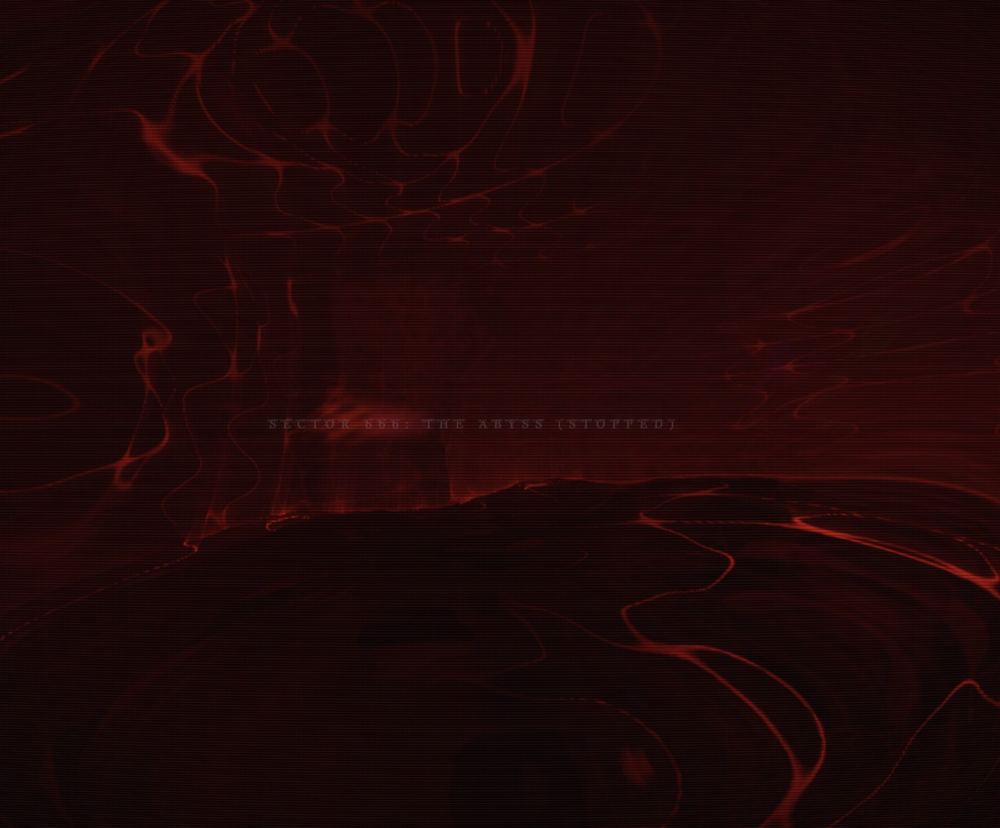

<div align="center">

</div>

𖤐𖤐𖤐𖤐𖤐

# [∳void ∂t]₂ ∩ [hell]ˣ ∉ [⦰∞]

to face death for the first time at the very moment it's come knoking on your door,
how i've come to believe it would feel. this shader, a journey to simulating that horror.

__watch 3 iterations and you'll see.__


---

## journeys

The landing page (`/`) is an index grid of shader **journeys**. Each journey is
its own route under `app/journeys/<slug>/`. `/assets` shows the Δ library.

Two import aliases, both in `tsconfig.json` and honoured by Next, bun and tsc:

| alias | points at | what |
| --- | --- | --- |
| `✦/…` | `src/…` | the app (it was `@/`) |
| `Δ`, `Δ/…` | `delta/…` | the asset library, a standalone module |

```
delta/                      # Δ — CC0 materials and skies from ambientCG (standalone module)
  manifest.ts               # what the assets are: pure data, the single source
  gl.ts                     # WebGL2 loaders: material texture arrays, mipmapped skies
  glsl.ts                   # GLSL ES 3.00: every map sampled, POM, triplanar, GGX, sky
  urls.ts                   # generated static imports (the bundler owns the files)
  build.mjs                 # download + pack everything: `bun delta/build.mjs`
  materials/, skies/        # the packed strips and the tonemapped sky maps
src/app/
  page.tsx                  # index grid landing
  assets/page.tsx           # Δ — every material as a lit sphere, every sky as a pan
  journeys/
    registry.ts             # journey metadata: title, tagline, accent, poster, preview shader
    definitions.ts          # every journey's definition by slug, for the harness and tools
    <slug>/journey.ts       # the journey, declared once (renderer, simulation, audio)
    <slug>/page.tsx         # one line: withJourneyShell(journey)
    liminal/                # THE LIMINAL JOURNEY (raymarched descent + audio)
    stairwell/              # THE STAIRWELL (six acts joined through walls, Δ-lit + audio)
    skybridges/             # SKYBRIDGES (collapsing glass spans over a cloud sea)
    foundry/                # THE FOUNDRY (seven halls, rigid-body physics, terminal fall)
    hollow-orchard/         # THE HOLLOW ORCHARD (fungal descent + audio)
    natatorium/             # THE NATATORIUM (flooded poolrooms, turning route + audio)
    switchback/             # THE SWITCHBACK (mine railway that tips over, then falls + audio)
    loop-line/              # THE LOOP LINE (rasterized closed circuit, nine bays, Δ-lit + audio)
    scenic-route/           # THE SCENIC ROUTE (rasterized coaster road, seven sections, cockpit + audio)
components/
  JourneyGrid.tsx           # grid + shared-preview host
  JourneyCard.tsx           # screenshot poster + hover-to-live preview
  ShaderPreviewLayer.tsx    # ONE shared WebGL canvas for all card previews
  withJourneyShell.tsx      # every route: the view (canvas, HUD, transport, title card)
  JourneyTransport.tsx      # the tape deck: chapter/lap jumps, a scrubbable bar
  JourneyTitleIntro.tsx     # the glitching title card every journey opens on
  AssetBrowser.tsx          # the /assets page: one shared canvas, scissored per card
hooks/
  use-journey-runtime.ts    # the engine under every route: GL, simulation, transport, governor, frame
  use-pan-control.ts        # pointer + gyroscope view panning (tweened)
  use-audio-engine.ts       # lazy per-journey audio + mute button state
lib/
  journey/                  # the contracts, definitions, frame evaluation, seek, transport, labels
  gl/                       # context, programs, the quad, uniforms, targets + post chain, CRT pass
  glsl/                     # shared GLSL: hashes, value noise + fbm generators, SDFs, ACES
  audio/                    # the JourneyAudio base every soundtrack extends, noise, uniform readers
  quality/                  # device profile, quality tiers, the adaptive resolution governor
  math.ts                   # clamp, mix, smoothstep, smootherstep, hash1 — GLSL's, on the CPU
  glitchTitle.ts            # the title card's renderer (displacement + byte corruption)
  canvasText.ts             # letter-spaced 2D canvas text
  frameLoopManager.ts       # ONE frame-capped rAF shared by every journey
  panControl.ts             # framework-free pan controller behind use-pan-control
  mat4.ts                   # column-major 4x4s, out-param and allocation-free
  curve.ts                  # closed Catmull-Rom, arc-length LUT, transported frames
  mesh.ts                   # VAO/VBO/IBO + instancing, and pre-fracturing into shards
  rng.ts                    # mulberry32 + integer hashes, for reproducible decay
tools/
  shoot-posters.mjs         # re-capture public/journeys/<slug>.jpg (live routes, or --bare)
  journey.mjs               # drive a journey deterministically (shot/film/probe/scan/fps/contact/glsl)
  harness/                  # --bare: a journey's renderer + simulation on a plain canvas, no Next
  verify-geometry.ts        # invariant checks for lib/curve, lib/mesh and the loop line's circuits
```

### looking around

Every journey steers its camera from one normalized `uPointer` (-1..1, y up),
fed by `lib/panControl.ts`:

* **pointer / touch** — absolute position over the viewport.
* **gyroscope** — device orientation is summed on top wherever the device
  reports it, so a phone pans by tilting as well as dragging. Tilt is measured
  against the pose you were holding when the readings started (and re-zeroed on
  rotation or when the tab comes back), and mapped through the screen
  orientation so "right" is right in landscape too. iOS only hands out
  orientation after a permission prompt. Gyroscope look can be enabled or
  disabled in **GRAPHICS & CONTROLS**; enabling it requests permission directly,
  while the default-on first visit still requests once on the first page tap.
* **tweening** — small moves follow the pointer immediately; a *jump* (a tap
  landing far from the last touch, a finger lifted and re-planted) is eased over
  a distance-scaled 0.16–0.5 s instead of teleporting the camera.

### routes that turn

Most journeys are a straight `+Z` scroll with the scenery changing around them.
Three are not, and all three solve it differently:

* **stairwell** keeps each act in its own coordinates and joins them *in space*:
  every act ends in a wall — a ribbed dam or a stratified cliff — with the stair
  running through a strip-lit portal tunnel, and the next act stands beyond it,
  shifted to meet the stair, visible through the far mouth. Which side of the
  wall a ray ends on decides its sun, sky and air; the slope blends through the
  tunnel with the rail height as its closed-form integral, so the camera is C¹
  across the switch of coordinate systems at the wall's midline. Anything sampled
  by position is sampled in a frame that does not change there, and three acts
  are always built — this one, the next, and the next one's far wall — so
  nothing arrives at the switch. See `stairwell/SPEC.md`.
* **switchback** rectifies instead: the track is always straight ahead in the
  cart's own frame and the *world* bends around it, fitted to a quadratic in
  depth. Grade therefore lives in the up vector rather than in the geometry,
  which is what lets the railway tip further over on every lap — by the fourth it
  is descending at nearly eighty degrees, and then the rails stop altogether. See
  `switchback/SPEC.md`.
* **natatorium** takes that idea and moves the table to the CPU. `kinematics.ts`
  owns an authored chain of sections and uploads, every frame, the affine
  transform carrying a point from the camera's current section into each
  neighbour's — so turns are *data* and can be any angle, and the shader holds no
  route table at all. Five things make it work:
  * **`min`, never `smin`.** Rooms are carved by unioning air boxes and negating.
    Inside a union `min` under-estimates distance to the boundary, which is the
    safe direction for a sphere trace; `smin` returns up to `k/4` *below* its
    inputs, so negating it over-estimates and a grazing ray at a door jamb
    punches through the wall. Corners are rounded with `sdRoundBox` instead —
    which is also what real tiled halls have, since coved corners are moppable.
  * **Every per-section quantity goes through the corner blend**, not just
    position. The camera pose is a weighted mix of both frames' predictions
    across a window straddling each boundary, so the path *and its tangent* are
    continuous and the camera arcs through a corner instead of doglegging. Miss
    one term — the lateral sway amplitude, say, which scales with room width —
    and that single scalar snaps the camera sideways at the join.
  * **Shading resolves the owning slot** — and so does anything else swept
    through the scene. This is the rule above applied to the GPU. `mapAir`'s
    union tells the march how far the concrete is and then throws away *whose*
    concrete it is, so every shading term downstream used to assume
    the answer was the camera's own section — and a room seen through a doorway
    was lit with the wrong width, ceiling height and lamp pitch, in a frame that
    rotated out from under it the moment the slot window advanced. `resolveSlot`
    re-runs the loop once at the hit point (one evaluation, against ninety-six)
    and returns the point, the normal and the view ray in the winner's own
    coordinates. A point's coordinates in a section's own frame do not change
    when the camera crosses a join, and that invariance is the whole fix. The
    lamp *halos* are the same rule and were missed for a long time: they are
    swept along a ray that goes wherever you look, so they must sum over all
    three slots, not the camera's — otherwise every halo on screen jumps the
    instant the slot window advances, while nothing in the picture behind them
    moves at all.
  * **Nothing added to the SDF may enter the walked tube.** Fittings and join
    dressing are intersected with the complement of a cylinder swept along the
    walked line. It cannot fail to clear the camera, because it is defined by
    where the camera goes. (hollow-orchard bores the same aisle with a capsule.)
  * **A bound is not a distance.** Every fitting and every join block bails
    early by handing back how far the point still is from the volume that
    encloses it, which is what makes a twenty-two metre pool affordable to
    cross. But the march cannot tell a bound from a surface: if one is allowed
    to reach zero the ray stops on it and it is *shaded as tile*. The flume's
    bounding sphere appeared as a tiled ball hanging over THE GRAND HALL, the
    slab around the lane ropes as a black lid twelve centimetres above the
    water, and the join zone's z-plane sealed the doorway it was dressing. Bail
    only while the bound is clear of the hit epsilon; everything a bound
    protects is thin, so the band this costs is thin too.
  * **Damage is geometry, decoration is shading, and they share one lattice.**
    A missing tile is a recess unioned into the air, cut on exactly the grid
    `tileSurface` draws grout on — same cell size, same per-face salt, same
    hash. A painted hole has no depth to be dark inside, no lip for a strip
    light to rake across and nowhere for the red to come out of. Only the cell
    the point is in is ever evaluated, which *over*-states the air and therefore
    under-states the concrete, the one direction a sphere trace may be wrong in.
    Tiles left standing are pushed proud by a non-negative offset *added* to the
    shell, which can only shorten a step.
  * **A quantised field through a pinhole draws the quantisation.** The red
    volumetric used to ask the tile lattice where the holes were. Adjacent
    pixels' taps land in the same cell, the per-cell answer is constant across a
    tile face, and what appeared on screen was a flat tile-shaped red rectangle
    — not a shaft, a decal. A term accumulated along a ray has to be continuous
    in space. The surface half of the effect knows about individual holes; the
    air half only needs to know it is near a wall.
  * **Detail must fade to its mean, not to zero.** Fourteen millimetres of grout
    on a 220mm tile is a third of a pixel at the far end of a twenty-two metre
    hall, and a third of a pixel of pure black sampled once per pixel is not a
    grout line, it is moiré — which is why every far wall in this building read
    as corduroy. There is no mip chain (nothing is textured) and no derivatives
    (ES 1.00 has no `dFdx` without an extension), so the footprint is estimated
    from distance and the grout *widens* as it fades. Widening keeps the wall
    reading as tiled; fading stops it shimmering.
  * **Animated offsets are functions of a uniform, never of position.** The
    blocks that reconfigure each doorway ride a single CPU-computed deploy
    scalar. An offset that varied with `p` would add its own derivative to the
    gradient, and in a *negated* field over-estimating is not an artifact — it is
    a grazing ray leaving the building. This is why the step factor here is still
    0.95 where foundry, which morphs geometry across its boundaries, has to cut
    to 0.78. Corollary: the deploy curve is quintic rather than the obvious
    damped hinge, because a hinge rings above 1 and settles back through it, and
    the shader culls the whole block set on `deploy >= 1`.

* **switchback** does not move the camera at all. Both of the above model a
  route as a *chain of straight rooms*; a rail is not that. A railway's defining
  quantity is curvature — continuous, and the thing that banks the car — so
  chopping it into segments with joins is precisely what you must not do. So the
  shader marches in a **rectified** space where the track is the +Z axis, dead
  straight, with the cart at the origin, and the real curve arrives as four
  floats: `bend(z) = (ax*z + bx*z^2, ay*z + by*z^2)`, fitted every frame and
  applied by looking a point up at `p.xy - bend(p.z)`. Rails, sleepers, trestle
  bents and lamps become lattices along a straight axis, which is as cheap as
  geometry gets, and there is **no world position at all** — not a small one like
  natatorium's section-local coordinates, none — so `?t=100000` is as exact as
  `?t=1`. Four things make *that* work:
  * **A bend is a shear, so it stretches distance.** For `T(p) = (p.xy - bend(z), z)`
    the Jacobian is the identity plus `bend'(z)` in one column, so
    `|grad(f o T)| <= 1 + |bend'(z)|` and dividing the whole map by that is
    provably conservative. It is a function of z, so near geometry marches at
    full speed and only the far end of a hard turn pays for it.
  * **Rectification has a range limit.** A track that turns 90 degrees inside the
    view distance leaves the +Z half-space and no quadratic can follow it out.
    That is what `MAX_CURV` is, and the route table asserts against it —
    pointwise for the shear's cost, and windowed for the correctness. It is not
    much of a constraint, because a coaster's turns are wide *because* it is
    fast: 44 metres of radius at 20 m/s is still 0.9g in your ribs.
  * **The fit is pinned by camera-space depth, not by arc length.** In a hard
    turn the track's depth grows far slower than its length — 88 metres of rail
    through a 60 degree sweep only reaches 56 metres ahead — so pinning by length
    puts the far knot outside the range the shader marches and lets the quadratic
    extrapolate across the part of the picture you can see.
  * **The car is bolted to the rail, so a bank rotates the world, not the rider.**
    Bent space is the track's frame and the bank is carried entirely by where
    `uUp` and `uSun` point. The honest consequence is that a banked turn is
    invisible inside a tunnel, exactly as it is in a real POV video, and the
    moment the walls fall away over the void the whole sky rolls.

  Two bugs this cost, both worth knowing because neither looks like its cause.
  **Iteration exhaustion is not a miss:** a ray down a long narrow bore grazes
  the wall for its whole length, burns all its steps on small useful-looking
  positive ones, and rendering that as sky put a wing-shaped hole through the
  roof of the chalk drift, in exactly the shape of the drift. **The fog has to be
  complete at the march limit, not merely thick:** either side of `T_MAX` the
  shader renders two different things, so any surface still showing through there
  draws the set of directions that just barely reach something — which over the
  overlook was a perfect dark arc hanging in the sunset with no object anywhere
  near it.

  A third, in the same family as natatorium's halo bug: **a room is a range of
  *depth*, and a ray not looking down the track covers less depth than distance.**
  Resolving the room from `t` rather than from `rd.z * t` says a ray fired
  sideways at ninety metres is ninety metres down the line, and lights the drift
  with the lamps of the room two portals away.

### debugging a journey

A journey is a clock, so everything interesting about it — which room you are in,
how flooded it is, how far a doorway has assembled — is a function of elapsed
time. Every journey therefore accepts a set of query parameters, honoured
centrally by `withJourneyShell`, that let you ask for one exact moment:

| param | meaning |
| --- | --- |
| `?t=42.5` | seek to 42.5s of journey time and hold there |
| `?debug=1` | overlay the live state and publish `window.__journeyDebug` (on by default with `?t=`) |
| `?dt=0.008` | the seek's fixed timestep (default 1/60) |
| `?hud=0` | hide the chrome, for a clean plate |
| `?w=1600&h=900` | exact backing-store size, ignoring dpr and the resolution setting |
| `?res=1` | resolution scale override |
| `?pointer=0.3,-0.2` | hold the pan offset, to look somewhere other than straight ahead |

```
/journeys/natatorium?t=30&w=1200&h=760          # the frame 7m before a join
/journeys/natatorium?t=30&hud=0&debug=0         # ...as a clean plate
```

`?t=` **seeks rather than jumps**, replaying the simulation from zero in fixed
increments. An integrating journey cannot be jumped — natatorium advances
`dist += speed * dt` and its speed depends on how deep the water is where it
already is — so the only way to know where `t` seconds puts you is to walk it,
and a fixed `dt` is what makes walking it reproducible. The same URL renders
byte-identical pixels across reloads and machines.

`document.documentElement.dataset.journeyReady` flips to `"1"` only once the
seeked frame is actually on the canvas, so a driver can wait on it instead of
sleeping and hoping:

```js
await page.goto(url)
await page.waitForSelector('html[data-journey-ready="1"]')
await page.screenshot({ path: 'shot.png' })
```

The overlay prints the uniforms grouped as the `vec4`s they are uploaded as,
which is usually the fastest way to find out that a value you believed was
varying is in fact pinned.

`tools/journey.mjs` drives all of this from a shell. It finds any Chromium
already in a Playwright cache — macOS's, Linux's, or `PLAYWRIGHT_BROWSERS_PATH`
— rather than insisting on the exact pinned build, and on Linux, where it is
almost always running in a container with no GPU, it asks for SwiftShader
(`JOURNEY_GL=gpu|swiftshader` overrides the guess):

```
node tools/journey.mjs shot    natatorium --t=30 --out=/tmp/a.png
node tools/journey.mjs film    natatorium --from=26 --to=34 --step=0.5
node tools/journey.mjs probe   natatorium --from=0 --to=60 --step=2 [--json]
node tools/journey.mjs scan    natatorium --from=4 --to=24 --step=0.4
node tools/journey.mjs uv      natatorium --t=30
node tools/journey.mjs hud     natatorium --from=0 --to=60 --step=2
node tools/journey.mjs fps     natatorium --at=11,24,48 --w=1200 --h=760
node tools/journey.mjs contact loop-line --bare --from=0 --to=140 --step=12 --cols=4
node tools/journey.mjs glsl    stairwell --bare
```

**`--bare` needs no dev server.** `tools/harness/serve.mjs` bundles the
journey's own renderer and simulation with bun (the `✦` and `Δ` aliases
resolve, Δ's images go through bun's file loader) and serves them on a plain
canvas that speaks the same protocol — `?t=&w=&h=&pointer=&dt=`, `window.__journeyDebug`,
`data-journey-ready` — so every command works against it unchanged. It starts
in about a second where a Next dev server compiles for a minute, and the bundle
is rebuilt on every page load, so an edited shader is in the next shot. It
covers every journey — it runs the same definitions the pages do — plus
`previews`, which compiles every landing-page preview shader. `node
tools/harness/serve.mjs` runs it standalone for a browser.

* **contact** is the cheap way to *look*: many instants in one image, each tile
  labelled with its time and section. Twelve 320×180 tiles cost about what one
  full-size screenshot does, and answer "does every section read as itself" in
  a glance.
* **glsl** loads one instant and reports every error raised while building the
  programs — a shader that fails to compile still leaves a black frame, so
  pixels cannot tell you — and exits 1 on any, so it can gate a commit.

* **probe** prints mean luminance, the fraction of pure-black pixels and the
  fraction of blown-out ones per timestamp. `blown` is the one to watch: a wall
  that clips to white has lost its grout, its mosaic course and its cracks, and
  the number says so long before the eye admits it.
* **scan** walks time finely and reports where the image *jumps* between
  neighbouring frames, normalised against the median so it reads as a multiple
  of the journey's own baseline motion. Turning a corner at 5 m/s legitimately
  changes most of the frame, so absolute deltas mean nothing — the multiple is
  what separates "sharp turn" from "something popped".
* **uv** reports horizontal against vertical detail, for the class of bug where
  the image is stable but wrong: a surface that picked the wrong projection axis
  smears into stripes and one of the two collapses.
* **hud** measures the DOM overlays instead of the canvas, printing each one's
  box per timestamp and flagging any that moves. Chrome is laid out by CSS and
  CSS is not on the journey's clock, so this is the only reliable way to tell an
  overlay that is genuinely drifting from one that merely looks like it because
  the picture behind it changed. "The overlays jump on each section change" was
  settled this way in a minute: every box pinned to the pixel, every label — so
  the thing moving was a *shader* overlay, the lamp halos, still being evaluated
  in the camera's section while pointing anywhere.
* **fps** holds an instant and counts frames. The journey caps itself at 60, so
  pass `--w/--h` above the default resolution to measure what the shader
  actually costs; a locked 60 tells you it is affordable but not by how much.

The honest way to use these is against a baseline.

The rewrites of the loop line and the stairwell were developed almost entirely
this way: `glsl` after every shader edit, a `contact` sheet per round of
changes, a `shot` only when a tile needed a closer look, and `scan` across every
boundary to prove a transition before calling it smooth. To test a single
switch, scan it at a fine step (`--step=0.01`): a pop is a fixed amount of
change while motion shrinks with the step, so a pop that hides at 0.1 s stands
out at 10 ms. Note that `scan` rebuilds the bundle per frame in `--bare` mode —
do not edit while one runs.

### verifying the geometry primitives

```bash
bun tools/verify-geometry.ts
```

Everything else here is verified by *looking* at it, and for a shader that is the
right instrument, because a wrong SDF looks wrong. `lib/curve` and `lib/mesh` are
not like that: they are pure maths with no picture of their own, they sit
underneath the thing you can see, and their failures stay invisible until they are
catastrophic. A spline that misses its own control points still produces a
perfectly plausible screenshot of the wrong track.

That is not hypothetical. The first cut of `lib/curve` multiplied centripetal knot
spacing into a *uniform* Catmull-Rom basis, so it interpolated nothing and tore at
every segment join — and it passed a suite of seven checks, because every one of
them measured the curve *through* its own arc-length LUT, and the LUT happily
resamples whatever shape it is handed.

So the checks in this file are chosen to be ones a wrong implementation cannot
pass: the curve must go through its control points; densely-sampled step lengths
must have no outlier; the total turning of a closed planar loop must be exactly
2*pi (a *pointwise* curvature check cannot catch a wrong differentiation variable,
because a coarse spline through circle points is legitimately not a circle); and
no triangle may straddle two fracture shards.
 Check out the last known-good
commit over the journey's own files, probe, restore, probe again, and compare —
the two columns settle arguments that screenshots do not.

### the fourth way of turning

There is a fourth, and it is the one that cheats.

* **loop-line** just builds the whole thing: nine bays and a chord, 2.08 km. The
  three approaches above all exist because the route is *unbounded* — a descent, a corridor chain, a railway that
  runs forever — so no amount of geometry can cover it and the world has to be
  generated around a moving observer. A **closed circuit is not unbounded**. It is
  2.08 km long and then it is the same 2.08 km again. So the entire loop is built
  once, out of actual triangles, in real world space, and an ordinary camera moves
  through it.

  Everything the other three work hardest at evaporates. There is no turn-radius
  floor, because nothing is being fitted to a quadratic. There is no coordinate
  drift, because arc length wraps at the loop length and the world never
  translates. And the track can cross over itself, which not one of the SDF
  journeys can express, because it is just vertices.

  What it buys beyond that is rupture you can afford. Meshes are pre-fractured at
  build time and displaced per-shard in the *vertex* shader from one uniform, so
  the world comes apart with nothing re-uploaded and no instruction added to the
  frame: the last lap costs exactly what the first did. See
  `app/journeys/loop-line/SPEC.md`.

### Δ — the asset library

`delta/` is a standalone module (its own `package.json`, imported as `Δ`) holding
every surface and sky the journeys borrow from the real world: fourteen CC0
material sets and ten HDRI skies from [ambientCG](https://ambientcg.com), packed
for WebGL2.

* **Every map is used.** Each material set ships colour, displacement, normal,
  roughness, ambient occlusion and (for metals) metalness; `bun delta/build.mjs`
  downloads them and packs three 512-px strips — colour; normal.xy + roughness;
  displacement + AO + metalness — one layer per material, uploaded as three
  `TEXTURE_2D_ARRAY`s. `Δ/glsl` samples all of them: normal mapping on a
  derivative-built tangent frame, GGX on the roughness, parallax occlusion on
  the displacement, AO on indirect light only, metalness into the Fresnel.
* **Skies are the HDRIs' tonemapped equirectangulars**, 2048×1024 JPEG, a tenth
  the size of the EXR and decoded natively; the highlight range is lifted back
  approximately in the shader, and irradiance comes from the mip chain. Each
  sky records where its sun is in the photograph, so a journey's light comes
  from where the picture says it does.
* **The files are static imports** (`delta/urls.ts`, generated), so the bundler
  owns them: Next emits them hashed under `_next/static/media` with the basePath
  applied; bun's file loader does the same for the bare harness.
* **Loading is asynchronous and renderers cannot wait**, so every loader returns
  a one-texel placeholder at once and swaps the real texture in. A renderer may
  implement `ready()`; the frozen `?t=` path does not raise
  `data-journey-ready` until it is true, so no screenshot is of a placeholder.

`/assets` shows the lot: every material as a lit sphere you can strip down to any
one map, every sky as a slow pan, on one shared canvas.

### adding a new journey

A journey is **declared once**, in `app/journeys/<slug>/journey.ts`, and
everything that runs journeys reads that declaration: the page, the bare harness,
the tools. `components/withJourneyShell` (a view over `hooks/use-journey-runtime`)
owns all the route machinery — context, resize, adaptive resolution, pointer,
settings, the frame loop, `?t=` seeking, HUD, transport, title card, debug panel.

```ts
// app/journeys/<slug>/journey.ts
export default defineJourney({
  slug:             '<slug>',
  renderer:         shaderRenderer(frag),          // or geometryRenderer / passRenderer
  createSimulation: createMySimulation,             // optional
  createAudio:      createMyAudio,                  // optional: renders the mute button
  sectionTitleClassName: '<slug>-sector-title',     // optional
})

// app/journeys/<slug>/page.tsx
'use client'
import { withJourneyShell } from '✦/components/withJourneyShell'
import journey from './journey'
export default withJourneyShell(journey)
```

Pick the renderer by what the journey is (`lib/journey/definition`):

* **`shaderRenderer(frag, { envMapUrl })`** — one GLSL ES 1.00 fragment shader on a
  full-screen quad, WebGL 1, no depth buffer. Six of the journeys are this.
* **`geometryRenderer(createScene)`** — triangles: WebGL 2 with `depth: true`; hand
  back your own scene object. Reach for `lib/mat4`, `lib/curve`, `lib/mesh`, and
  `lib/gl`'s `createPostChain` for the MSAA → resolve → bloom frame. `loop-line` is
  the worked example. (A rasterizer without a depth buffer draws its rooms in
  submission order and you see straight through the walls.)
* **`passRenderer(create)`** / **`passRendererWebGL1(create)`** — a hand-built
  multi-pass renderer (raymarch into a target, then post): `stairwell/` on WebGL 2,
  `liminal/` on WebGL 1.

The rest of the definition:

* `createSimulation()` — a CPU simulation, stepped once per frame on the
  speed-scaled delta; its `uniforms()` go straight to the renderer and its
  `label()` drives the HUD. Use it whenever speed varies by section, because then
  position is an *integral* and has no closed form.
* `marks()` on the simulation — or `marksAt(time)` in the definition, for a
  journey with no simulation (`sectionNameAt(time)` for its label). Which lap,
  which section, how far through: the transport navigates by *structure*.
* `createAudio()` — a soundtrack: extend `JourneyAudio` (`lib/audio`), build the
  graph in `build()`, and modulate it from the frame's uniforms in `update()`.
* Shared GLSL comes from `lib/glsl` (`${HASH21}`, `${valueNoise2('hash21')}`,
  `${SD_BOX}`, `${ACES}`…); shared scalar maths from `lib/math`; HUD labels from
  `lapLabel`.

Then add it to `app/journeys/definitions.ts`, and:

2. Append an entry to `JOURNEYS` in `app/journeys/registry.ts` (title, tagline,
   tags, accent, gradient, and a compact `previewShader` for the hover preview).
   Export the preview shader from your own `shader.ts` and import it here. Keep it
   cheap and **self-driving from `iTime` alone** — the grid attaches no simulation,
   so a preview that reads `uStage`/`uCam` renders a black card.

   A preview is **always GLSL ES 1.00**, even for a geometry journey whose own
   renderer is WebGL2: every card's preview shares one WebGL 1.0 context, so the
   preview cannot be the journey's real renderer and has to fake the shot.
3. Add a poster screenshot at `public/journeys/<slug>.jpg` and set `poster` in
   the registry — `node tools/shoot-posters.mjs` captures one from the running
   route. The card's art falls back screenshot-first: live preview on hover,
   the screenshot wherever WebGL or hover isn't available (phones, mostly), the
   CSS gradient only if the image itself fails to load.

The landing grid picks it up automatically from the registry; the journey's title
card takes its title, tagline and accent from the same entry.

> **Note:** the card hover previews all share a **single** WebGL context
> (`ShaderPreviewLayer`) so the page never trips the browser's per-document
> context limit, no matter how many journeys are listed.

### develop

```bash
bun install
bun run dev      # http://localhost:3000
bun run build
```


## phones, and frame rate

The journeys are fragment-bound raymarches and HDR rasterizers, and a phone's GPU
is a tenth of a desktop's driving a screen with as many pixels, so the render
scale is not a constant (`lib/quality`):

* **AUTO resolution** (the default) hands the backing-store scale to a governor.
  It measures windows of real frame times, steps the scale down by √(budget /
  frame time) when a window runs over (fragment cost is proportional to pixel
  count), and probes back up 10% at a time once frames have held the budget for a
  while. A probe that costs more than there was is reverted and the next waits
  twice as long, so a device exactly at its limit settles instead of hunting.
* **Device tiers** set the starting point and the knobs a renderer reads from
  `frame.quality`: on a phone the scale starts around half of CSS resolution, MSAA
  is off and the bloom chain is three levels deep; heavy effects default off.
* **The frame loop** delivers real elapsed time even when capped — it used to
  hand a fixed 1/fps step to every frame, so a device managing 20 fps under a 60
  cap played every journey at a third of its speed — and tolerates rAF jitter, so
  a 60 cap on a 60 Hz display no longer drops frames that arrive 0.1 ms early.
* **Nothing composites that need not.** The display grade rides on the CRT pass
  instead of a CSS filter on the canvas (a full-screen compositing pass per frame
  at native resolution); the section title's glitch layers stop animating once it
  has faded; the scanline layer is left off on a low-tier phone; the transport
  bar and the FPS readout write to the DOM directly instead of re-rendering React
  sixteen times a second.

## the title card

Every journey opens on its name (`components/JourneyTitleIntro`,
`lib/glitchTitle`): it fades up out of black with the tagline under it, holds,
and then the signal carrying it fails — the black tears away in bands, the title's
channels separate and its slices slide sideways, and its bytes go bad (copies at
offsets that are not multiples of four rotate the channels, rows smear, bits flip,
8×8 blocks posterise like a codec that lost its residuals). The corrupted variants
are built one per frame during the hold, so the card never stalls a frame, and its
clock is its own frames — a journey compiling its shaders behind it cannot eat it.
A tap or a key skips to the tear-out; reduced motion gets a plain fade. Never shown
under `?t=` or `?hud=0`.

## the transport, and the CRT

Every journey carries a tape deck (`components/JourneyTransport`), driven by
`lib/journey/transport`:

* **◀◀ / ▶▶** — previous / next *chapter*: a cut to the start of the section, never
  a shuttle through time. ◀◀ restarts the chapter you are in, or goes one further
  if you have only just entered it.
* **⏮ / ⏭** — the start of this lap / the next lap.
* **the bar** — press, drag, or tap anywhere on it to scrub through the lap; arrow
  keys step it when focused. The ticks are the section boundaries.

The hard part is that a journey is an *integrator*, not a timeline — `z += speed(z)
* dt`, with speed depending on where you already are — so a time cannot be jumped
to, only replayed (`seekSimulation`, `lib/journey/seek`). The transport decides
which `t` to replay to, and forward and backward are asymmetric on purpose:

* **forward** — the destination is not known in advance, so the live simulation is
  stepped fast, in one frame, while `marks()` is watched until it gets there.
* **backward** — the destination *is* known, because time only ever starts at
  zero. Everything behind the playhead was watched on the way out: a log of when
  each section began, and a track of where along the lap every instant was. Going
  back reads the log (or interpolates the track, for a scrub) and replays a fresh
  simulation to that time.

A cut lands on exactly the timestamp it left from, because the seek divides `t`
into equal steps rather than stepping until it overshoots. A scrub applies at most
once per frame, the latest pointer position winning, so a fast drag never queues
replays.

`lib/gl/crtPass` is the one post-process every journey shares: tube curvature,
chromatic offset, aperture mask, vignette, the tape treatment the transport
plays over the top — and the display grade (brightness, contrast), so the canvas
never needs a CSS filter. It does **not** re-plumb the renderers to draw into an FBO —
every journey already finishes its frame on the default framebuffer, so the pass
copies that back buffer into a texture mid-frame and draws over it. Nothing
upstream knows it exists. Two constraints worth knowing before touching it: the
capture texture must be `RGB`, not `RGBA` (the shell asks for `alpha: false`
contexts, and copying into a format that needs a component the read buffer lacks
is a silent `INVALID_OPERATION` that leaves every journey black), and the shader
is GLSL ES 1.00 because the shell hands out both `webgl` and `webgl2` contexts.

Both are suppressed under `?t=` and `?hud=0`, so `tools/journey.mjs` stays
deterministic. The CRT pass can be switched off in Settings.

## the signal going

Every journey now either ends somewhere it never leaves — the stairwell's
purgatory, the switchback's fall, liminal's abyss, the orchard's compost — or laps
until the lapping has stopped meaning anything. All of them used to just continue
at full picture quality, which reads as "the demo is still running" rather than as
the end of something. `lib/signalLoss` is what marks it.

Eight seconds into that state the picture starts to fail; it takes fifteen more to
arrive; and it never recovers, settling at a weak, torn, colourless signal rather
than at black. A warning caption fades up, and eight seconds later a dB meter
drops in under it with the reception falling away.

Three things about it are worth knowing before touching it.

**The caption is composited in GL, not DOM.** `lib/gl/crtPass` works by reading the
canvas back buffer and drawing over it, so anything in DOM ends up flat and square
on top of a curved, torn, fringed picture — which gives the whole effect away in
one frame. `lib/signalOverlay` draws to a 2D canvas instead, and the pass samples
it at the same warped uv and through the same chromatic offset as the scene. It
takes only a third of the tearing and none of the lost vertical lock, because a
warning is generated at the receiver rather than transmitted, and at full amplitude
the words stop being words.

**Everything is a pure function of simulation state, because `?t=` is.** The
obvious implementation — a wall-clock accumulator in the shell — cannot work:
`seekSimulation` replays a simulation from zero without the shell observing, so the
loss would vanish on every seek. Instead each simulation counts its own seconds in
its own `step` and reports them as `JourneyMarks.signalAge`; the dB trace is
sampled from `dbAt()` per column rather than kept as a scrolling history for the
same reason. Two `shot`s of the same `?t=` are byte-identical, graph included.

**It is not behind the CRT setting.** The pass runs whenever the signal is going,
with the tube's curvature and scanlines zeroed (`CRT_BYPASS`) if the setting is
off. The setting governs a display treatment; this is a story beat.

Which journeys, and when: the four with a persistent ending trigger on entering it;
the four that lap forever trigger on `SIGNAL_LOSS_LAP`, a per-journey constant
(5 everywhere) standing in for an ending they do not have.

One trap, already paid for: anything that hashes on time must wrap the clock
first (`tickAt` in `lib/gl/crtPass`). These journeys run for an hour, and `hash()` takes
`sin()` of a dot product — feed it an unwrapped clock and the argument runs past
what a highp float carries, `sin()` stops varying, and the noise freezes into a
constant. A constant offset does not read as noise; at signal-loss amplitudes it
subtracts the entire picture.
